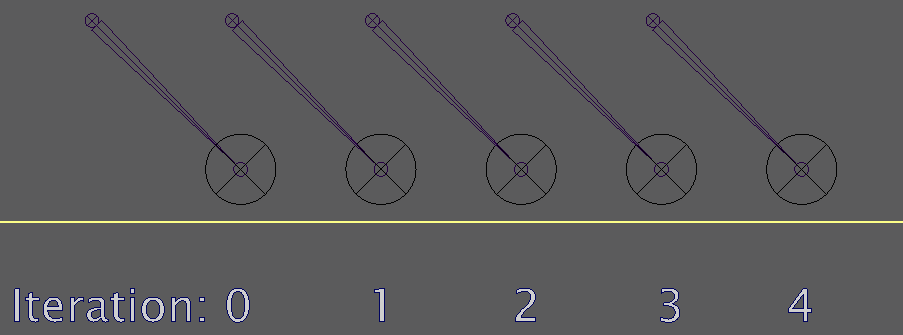
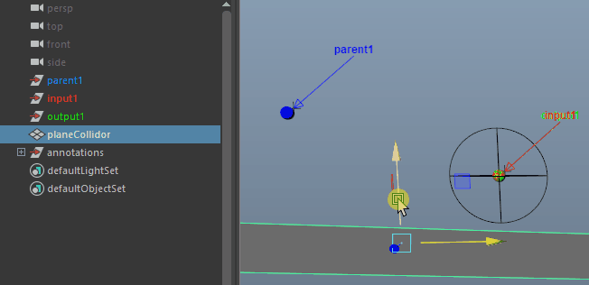
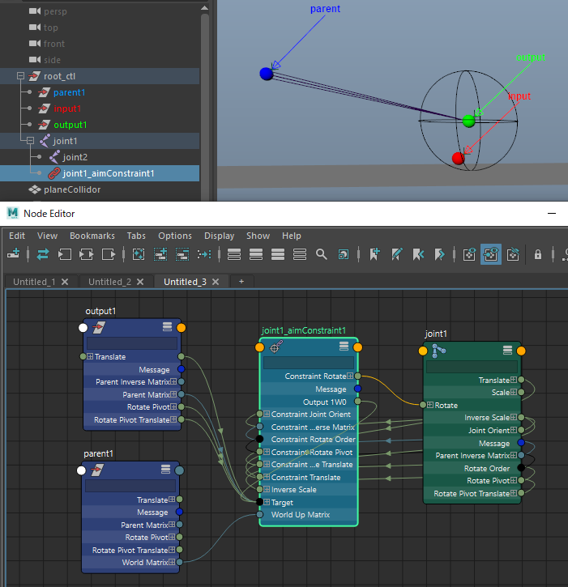

# Overview
   

Create collision detection using expression node.  
It is created only with expression node of Maya standard function. No plug-in node or other installation is required.  

> **Supported :**  
> * Maya 2024 (Python3.10.8)  
> * Maya 2023 (Python3.9.7)  
> * Maya 2022 (Python3.7.7)  
> * Maya 2020 (Python2.7.11)  
> * Maya 2019 and below are **"not"** supported

Example of capsule collider :  
  

# Supported colliders
  
* Infinite Plane
* Sphere
* Capsule
* Capsule2 (radius individually)
* Cuboid

# Installation

> **Note**  
> `expcol` module is required on rigging, but is not needed on animation.

## pip install (2.0.0 or higher)
```
cd C:\Program Files\Autodesk\Maya2024\bin
mayapy -m pip install -U git+https://github.com/akasaki1211/maya_expressionCollision.git
```
To specify version and location :
```
mayapy -m pip install -U git+https://github.com/akasaki1211/maya_expressionCollision.git@2.0.0 -t C:\Users\<USERNAME>\Documents\maya\2024\scripts\site-packages
```

## manual install
1. Zip download the Code and unzip it to any location.  
2. Please do one of the following:
   * Copy the `expcol` directory into the `C:\Users\<USERNAME>\Documents\maya\scripts`.
   * Add the parent directory of `expcol` to PYTHONPATH environment variable.
   * Add the parent directory of `expcol` to PYTHONPATH in Maya.env.

# Usage
## Create Collider
```python
from expcol import collider

collider.iplane()   # Infinite Plane
collider.sphere()   # Sphere
collider.capsule()  # Capsule
collider.capsule2() # Capsule2 (radius individually)
collider.cuboid()   # Cuboid
```

## Create Detection
```python
from expcol import detection

detection.create(
    'input', 
    'output', 
    'controller', 
    parent='parent', 
    colliders=collider_list, 
    groundCol=True, 
    scalable=False,
    radius_rate=None,
)
```
||||
|---|---|---|
|`input`|str|Child 'transform' or 'joint' before correction.|
|`output`|str|Child 'transform' or 'joint' after correction.|
|`controller`|str|Any node to add attributes for control.|
|`parent`|str, optional|Parent 'transform' or 'joint'.|
|`colliders`|list, optional|List of collider names. Defaults to [].|
|`groundCol`|bool, optional|Add horizontal plane collision. Defaults to False.|
|`scalable`|bool, optional|Allow for parent scale of joint-chain and parent scale of colliders. Defaults to False.|
|`radius_rate`|float, optional|Rate at which radius and tip radius are interpolated, between 0 and 1. Defaults to None.|

> **Note**  
> For more information on `input`, `output` and `parent`, please click [here](#what-are-input-output-and-parent).  

If you just want to add an attribute to a controller, do the following. It is also called in `detection.create`.  
```python
detection.add_control_attr(
    'controller', 
    groundCol=True, 
    tip_radius=True
)
```

## Example
Running the following code will create a sample joint, create a collider, and even create a detection.  
```python
from maya import cmds
from expcol import collider, detection

# Create sample joint chain
rootCtl = cmds.createNode('transform', n='rootCtl')
jointList = []
for i in range(5):
    jointList.append(cmds.joint(n='joint_{}'.format(i), p=[i*3,0,0]))
cmds.setAttr(rootCtl+'.ty', 5)

for i in range(len(jointList)-1):
    p = cmds.listRelatives(jointList[i], p=True)[0]
    pos1 = cmds.xform(jointList[i], q=True, ws=True, t=True)
    pos2 = cmds.xform(jointList[i+1], q=True, ws=True, t=True)
    prt = cmds.createNode('transform', n='parent_{}'.format(i), p=p)
    ipt = cmds.createNode('transform', n='input_{}'.format(i), p=p)
    out = cmds.createNode('transform', n='output_{}'.format(i), p=p)
    cmds.xform(prt, ws=True, t=pos1)
    cmds.xform(ipt, ws=True, t=pos2)
    cmds.xform(out, ws=True, t=pos2)
    cmds.aimConstraint(out, jointList[i], u=[0,0,1], wu=[0,0,1], wut='objectrotation', wuo=prt)

# Create Colliders
collider_list = []
collider_list.append(collider.iplane())
collider_list.append(collider.capsule())

# Create Detections
for i in range(len(jointList)-1):
    detection.create(
        'input_{}'.format(i), 
        'output_{}'.format(i), 
        'rootCtl', 
        parent='parent_{}'.format(i), 
        colliders=collider_list, 
        groundCol=True, 
        scalable=True,
        radius_rate=float(i)/float(len(jointList)-2)
    )
```

## `groundCol` option
Setting groundCol to True adds an invisible horizontal collision. The height can be changed with the GroundHeight value.  


## `scalable` option
If scalable is set to True, the scale of the parent of the joint-chain or the parent of the collider is reflected.  
|scalable=True|scalable=False|
|---|---|
|||

## `radius_rate` option
Interpolate radius and tip_radius by the radius_rate value. 0.0 matches radius and 1.0 matches tip_radius.  


## `parent` option
When creating a detection for bone with length, `parent` option is usually used.  
If parent is not specified, a simple point detection is created.  


### example
```python
from maya import cmds
from expcol import collider, detection

# Create input and output
rootCtl = cmds.createNode('transform', n='rootCtl')
in_point = cmds.createNode('transform', n='input')
out_point = cmds.createNode('transform', n='output')
cmds.parent(in_point, rootCtl)
cmds.parent(out_point, rootCtl)
cmds.setAttr(rootCtl + '.ty', 5)

# Create Colliders
collider_list = []
collider_list.append(collider.sphere())
collider_list.append(collider.capsule())

# Create Detection
detection.create(
    in_point, 
    out_point, 
    rootCtl, 
    colliders=collider_list, 
    groundCol=True, 
    scalable=True
)
```

## Collision Iteration
High `Colision Iteration` value increases the accuracy of collisions, but also increases the processing laod. Recommended value is 3 to 5. 0 disables detections.  


# What are Input, Output, and Parent?

|||
|---|---|
|Input|world position of the child joint before correction.|
|Output|world position of the child joint after correction.|
|Parent|world position of the parent joint.|

Each is just transform node, and there is no input connection to translate of Parent and Input.  


Also, joint chain is not directly related to collision. It will be controlled by aim constraint or IK later.  


If you have more than two joint chain, create the same node graph in the child hierarchy.  
It's the same for all patterns like Capsule, Infinite plane, Sphere...  


# Sample script
Below is a sample script to create detections on any joint-chain. It should be run by selecting controller, then root-joint. X-axis of each joint must face the child.  


```python
from maya import cmds
from expcol import collider, detection

# Get selection from Maya's scene
sel = cmds.ls(sl=True)
ctl = sel[0]           # The first selected object is a control
root_joint = sel[1]    # The second selected object is the root joint

# Function to get all child joints of a given node recursively
def get_children(node):
    children = []
    child = cmds.listRelatives(node, c=True, type=["joint", "transform"])
    if child:
        children.append(child[0])
        children.extend(get_children(child[0]))
    return children

joints = [root_joint] + get_children(root_joint) # List of all joints starting from the root

parents = []
inputs = []
outputs = []

# Iterate over pairs of joints to set up constraints and transforms
for a, b in zip(joints, joints[1:]):
    
    p = cmds.listRelatives(a, p=True) # Get parent of joint a
    if p:
        p = p[0]
    
    a_pos = cmds.xform(a, q=True, ws=True, t=True) # Get world position of joint a
    a_rot = cmds.xform(a, q=True, ws=True, ro=True) # Get world rotation of joint a
    b_pos = cmds.xform(b, q=True, ws=True, t=True) # Get world position of joint b
    
    # Create auxiliary transforms for detection setup
    prt = cmds.createNode('transform', n='{}_parent'.format(a), p=p)
    ipt = cmds.createNode('transform', n='{}_input'.format(a), p=p)
    out = cmds.createNode('transform', n='{}_output'.format(a), p=p)
    
    # Set the position and rotation for the created nodes
    cmds.xform(prt, ws=True, t=a_pos)
    cmds.xform(prt, ws=True, ro=a_rot) # Because parent is specified as worldUpObject in aimConstraint, rotation must also be aligned.
    cmds.xform(ipt, ws=True, t=b_pos)
    cmds.xform(out, ws=True, t=b_pos)
    
    # Aim constraint to align joint a towards joint b
    cmds.aimConstraint(out, a, aim=[1,0,0], u=[0,0,1], wu=[0,0,1], wut='objectrotation', wuo=prt)
    
    parents.append(prt)
    inputs.append(ipt)
    outputs.append(out)

# Create Colliders
collider_list = []
collider_list.append(collider.iplane())  # Adding an infinite plane collider
collider_list.append(collider.capsule()) # Adding a capsule collider

# Create Detections for each joint
for prt, ipt, out in zip(parents, inputs, outputs):
    detection.create(
        ipt, 
        out, 
        ctl, 
        parent=prt, 
        colliders=collider_list, 
        groundCol=True, 
        scalable=True
    )
```

# Note
* A large number of detections can be very heavy.
* The number of colliders cannot be changed after a detection (expression node) is created.

## Processing time
Processing time per joint measured using maya's profiler.  
|Collider (Iteration:5)|Avg|
|---|---|
|sphere|32.57 us|
|iplane|33.70 us|
|capsule|39.27 us|
|capsule2|48.94 us|
|cuboid|50.30 us|

> * Windows 11  
> * Intel(R) Core(TM) i7-10700 CPU @ 2.90GHz  
> * Maya 2024  
