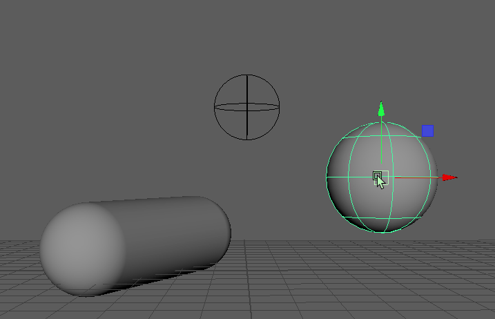
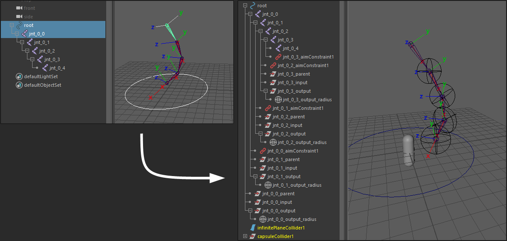

# Overview
   

`expcol`はMaya標準のexpressionノードのみを使用してコリジョン検出を作成します。 
リギング工程でのみインストールが必要になりますが、アニメーション工程ではプラグインやその他インストールは必要ありません。  

> **対応Mayaバージョン:**  
> * Maya 2024 (Python3.10.8)  
> * Maya 2023 (Python3.9.7)  
> * Maya 2022 (Python3.7.7)  
> * Maya 2020 (Python2.7.11)  
> * Maya 2019 以下はサポート**していません**

カプセルコライダーの例 :  
  

# 対応コライダー
  
* Infinite Plane (無限平面)
* Sphere (球)
* Capsule (カプセル)
* Capsule2 (半径を個別に変えられるカプセル)
* Cuboid (直方体)

# インストール

> **メモ**  
> `expcol`モジュールはリギング工程でのみ使用します。アニメーション工程には不要です。  

## pipインストール (2.0.0以降)
```
cd C:\Program Files\Autodesk\Maya2024\bin
mayapy -m pip install -U git+https://github.com/akasaki1211/maya_expressionCollision.git
```
バージョンやインストール先を指定する場合 :
```
mayapy -m pip install -U git+https://github.com/akasaki1211/maya_expressionCollision.git@2.0.0 -t C:\Users\<USERNAME>\Documents\maya\2024\scripts\site-packages
```

## マニュアルインストール
1. Zipでコードをダウンロードし、任意の場所に解凍してください。  
2. 次のいずれかを行ってください :
   * `expcol`フォルダを`C:¥Users<USERNAME>¥Documents¥maya¥scripts`にコピー
   * `expcol`の親ディレクトリを環境変数 PYTHONPATH に追加
   * Maya.envの PYTHONPATH に`expcol`の親ディレクトリを追加

# 使い方
## コライダー作成
```python
from expcol import collider

collider.iplane()   # 無限平面
collider.sphere()   # 球
collider.capsule()  # カプセル
collider.capsule2() # 半径を個別に変えられるカプセル
collider.cuboid()   # 直方体
```

## コリジョン検出作成
```python
from expcol import detection

detection.create(
    'input', 
    'output', 
    'controller', 
    parent='parent', 
    colliders=collider_list, 
    groundCol=True, 
    scalable=False,
    radius_rate=None,
)
```
||||
|---|---|---|
|`input`|str|調整前の子の 'transform' または 'joint'|
|`output`|str|調整後の子の 'transform' または 'joint'|
|`controller`|str|コントロールアトリビュートを追加する任意のノード|
|`parent`|str, オプション|親の 'transform' または 'joint'|
|`colliders`|list, オプション|コライダー名のリスト。デフォルトは[]|
|`groundCol`|bool, オプション|水平平面コリジョンを追加。デフォルトはFalse|
|`scalable`|bool, オプション|ジョイントチェーンの親のスケールとコライダーの親のスケールを有効にする。デフォルトはFalse|
|`radius_rate`|float, オプション|RadiusとTip Radiusを補間するレート（0～1）。デフォルトはNone|

> **メモ**  
> `input`、`output`、`parent`について詳細は[こちら](#what-are-input-output-and-parent)  

コントロールアトリビュートを追加したいだけの場合は次のようにします。`detection.create`内でも呼び出されます。  
```python
detection.add_control_attr(
    'controller', 
    groundCol=True, 
    tip_radius=True
)
```

## クイックサンプル
以下のコードを実行すると、サンプルのジョイント作成、コライダー作成、コリジョン検出作成まで行われます。  
```python
from maya import cmds
from expcol import collider, detection

# ジョイントチェーン作成
rootCtl = cmds.createNode('transform', n='rootCtl')
jointList = []
for i in range(5):
    jointList.append(cmds.joint(n='joint_{}'.format(i), p=[i*3,0,0]))
cmds.setAttr(rootCtl+'.ty', 5)

for i in range(len(jointList)-1):
    p = cmds.listRelatives(jointList[i], p=True)[0]
    pos1 = cmds.xform(jointList[i], q=True, ws=True, t=True)
    pos2 = cmds.xform(jointList[i+1], q=True, ws=True, t=True)
    prt = cmds.createNode('transform', n='parent_{}'.format(i), p=p)
    ipt = cmds.createNode('transform', n='input_{}'.format(i), p=p)
    out = cmds.createNode('transform', n='output_{}'.format(i), p=p)
    cmds.xform(prt, ws=True, t=pos1)
    cmds.xform(ipt, ws=True, t=pos2)
    cmds.xform(out, ws=True, t=pos2)
    cmds.aimConstraint(out, jointList[i], u=[0,0,1], wu=[0,0,1], wut='objectrotation', wuo=prt)

# コライダー作成
collider_list = []
collider_list.append(collider.iplane())
collider_list.append(collider.capsule())

# コリジョン検出作成
for i in range(len(jointList)-1):
    detection.create(
        'input_{}'.format(i), 
        'output_{}'.format(i), 
        'rootCtl', 
        parent='parent_{}'.format(i), 
        colliders=collider_list, 
        groundCol=True, 
        scalable=True,
        radius_rate=float(i)/float(len(jointList)-2)
    )
```

## `groundCol` オプション
groundCol をTrueに設定すると、見えない水平平面コリジョンが追加されます。高さは GroundHeight で変更できます。  


## `scalable` オプション
scalable をTrueに設定すると、ジョイントチェーンの親やコライダーの親のスケールが反映されるようになります。  
|scalable=True|scalable=False|
|---|---|
|||

## `radius_rate` オプション
RadiusとTip Radiusをradius_rateで補間します。レートが0.0だとRadiusに一致し、1.0だとtip_radiusに一致します。  


## `parent` オプション
長さのあるボーンのコリジョン検出を作成する場合、通常は `parent` オプションを使用します。  
parent を指定しなかった場合は単純な「点」のコリジョン検出が作成されます。  


### 例
```python
from maya import cmds
from expcol import collider, detection

# input と output を作成
rootCtl = cmds.createNode('transform', n='rootCtl')
in_point = cmds.createNode('transform', n='input')
out_point = cmds.createNode('transform', n='output')
cmds.parent(in_point, rootCtl)
cmds.parent(out_point, rootCtl)
cmds.setAttr(rootCtl + '.ty', 5)

# コライダー作成
collider_list = []
collider_list.append(collider.sphere())
collider_list.append(collider.capsule())

# コリジョン検出作成
detection.create(
    in_point, 
    out_point, 
    rootCtl, 
    colliders=collider_list, 
    groundCol=True, 
    scalable=True
)
```

## Collision Iteration
Colision Iterationを上げるとコリジョンの精度が高くなりますが、処理負荷も上がります。推奨値は3～5です。0でコリジョンが無効になります。  


# Input, Output, Parentとは?

|||
|---|---|
|Input|調整前の子jointのワールド位置|
|Output|調整後の子jointのワールド位置|
|Parent|親jointのワールド位置|

それぞれは単純なtransformノードです。ParentとInputのtranslateには何も入力されていません。  


また、jointチェーンはコリジョンとは直接の関係がありません。後からaimコンストレイントやIKによって制御します。  


jointチェーンが2つ以上ある場合は、子階層に同じノード構成を作ります。  
カプセル、無限平面、球などすべてのパターンで同じです。  


# サンプルスクリプト
以下は、任意のジョイントチェーンでコリジョン検出を作成するためのサンプルスクリプトです。コントローラー、ルートジョイントの順で選択して実行します。各ジョイントのX軸は子ジョイントの方向を向いている必要があります。



```python
from maya import cmds
from expcol import collider, detection

# 選択を取得
sel = cmds.ls(sl=True)
ctl = sel[0]           # 最初の選択をコントローラーに設定
root_joint = sel[1]    # 2番目の選択をジョイントチェーンのルートに設定

# 指定したノードの全ての子ジョイントを再帰的に取得する関数
def get_children(node):
    children = []
    child = cmds.listRelatives(node, c=True, type=["joint", "transform"])
    if child:
        children.append(child[0])
        children.extend(get_children(child[0]))
    return children

joints = [root_joint] + get_children(root_joint) # ルートから始まる全jointのリスト

parents = []
inputs = []
outputs = []

# jointリストのペアに対し、コンストレイントとtransformノードを作成
for a, b in zip(joints, joints[1:]):
    
    p = cmds.listRelatives(a, p=True) # joint a の親を取得
    if p:
        p = p[0]
    
    a_pos = cmds.xform(a, q=True, ws=True, t=True) # joint a のワールド位置を取得
    a_rot = cmds.xform(a, q=True, ws=True, ro=True) # joint a のワールド回転を取得
    b_pos = cmds.xform(b, q=True, ws=True, t=True) # joint b のワールド位置を取得
    
    # 補助transformを作成
    prt = cmds.createNode('transform', n='{}_parent'.format(a), p=p)
    ipt = cmds.createNode('transform', n='{}_input'.format(a), p=p)
    out = cmds.createNode('transform', n='{}_output'.format(a), p=p)
    
    # 作成したノードの位置と回転を設定する
    cmds.xform(prt, ws=True, t=a_pos)
    cmds.xform(prt, ws=True, ro=a_rot) # aimConstraintで親がworldUpObjectと指定されているため、回転も揃える必要があります。
    cmds.xform(ipt, ws=True, t=b_pos)
    cmds.xform(out, ws=True, t=b_pos)
    
    # joint a を joint b の方向にaimコンストレイント
    cmds.aimConstraint(out, a, aim=[1,0,0], u=[0,0,1], wu=[0,0,1], wut='objectrotation', wuo=prt)
    
    parents.append(prt)
    inputs.append(ipt)
    outputs.append(out)

# コライダー作成
collider_list = []
collider_list.append(collider.iplane())  # 無限平面コライダー追加
collider_list.append(collider.capsule()) # カプセルコライダー追加

# 各jointにコリジョン検出を作成
for prt, ipt, out in zip(parents, inputs, outputs):
    detection.create(
        ipt, 
        out, 
        ctl, 
        parent=prt, 
        colliders=collider_list, 
        groundCol=True, 
        scalable=True
    )
```

# パフォーマンス
* コリジョン検出の数が多いと非常に重くなります。  
* コライダーの数はコリジョン検出（expressionノード）の作成後に変更することはできません。  

## 処理時間⏱
Mayaのプロファイラを使用して計測した、1ジョイントあたりの処理時間。  
|Collider (Iteration:5)|Avg|
|---|---|
|sphere|32.57 us|
|iplane|33.70 us|
|capsule|39.27 us|
|capsule2|48.94 us|
|cuboid|50.30 us|

> * Windows 11  
> * Intel(R) Core(TM) i7-10700 CPU @ 2.90GHz  
> * Maya 2024  

## より高速に🚀
カスタムノード [colDetectionNode](https://github.com/akasaki1211/colDetectionNode) を使用すると処理速度が上がります。  


1. **colDetectionNode.mll**をplug-insフォルダに配置しロードできる状態にしてください。  
2. `detection.CreateConfig.set_type("customnode")` を `detection.create` の前に追記してください。  
   * `parent` が必須になります。  
   * `groundCol` は無効になります。(そもそも後で変更可能なため)  
   * `scalable` は無効になります。(常時スケールが有効なため)  

```python
### 2.1.1 以降 ###

from expcol import detection

# colDetectionMtxNode を使用する
detection.CreateConfig.set_type("customnode")

# expression を使用する（※デフォルト）
#detection.CreateConfig.set_type("standard")

# "customnode"モードでは、
# - 'parent' が必須になります。
# - 'groundCol' が無効になります。(そもそも後で変更可能なため)
# - 'scalable' が無効になります。(常時スケールが有効なため)
detection.create(
    'input', 
    'output', 
    'controller', 
    'parent',           # 必須
    colliders=collider_list, 
    groundCol=True,     # 無効
    scalable=False,     # 無効
    radius_rate=None,
)
```

> **メモ**  
> プラグイン **colDetectionNode.mll** はアニメーション工程でも必要になります。

# 応用例

## mGear "chain_spring_01" と組み合わせる
[**chain_spring_add_collision.py**](https://gist.github.com/akasaki1211/ca89779097afcc2a5a784766d8bc056f) は [mGear](https://github.com/mgear-dev/mgear4) `chain_spring_01` にコリジョン判定を追加する**カスタムステップ**です。元の`chain_spring_01`では出来ないスケールのアンロックも同時に行います。設定は`config`関数で変更できます。  
[[デモ](https://twitter.com/akasaki1211/status/1743857075091099980)]  

**設定方法:**
1. expcol 2.1.1以降をインストール
2. expcolでコライダー作って、"collider_grp"という名前のグループ直下に配置。
3. chain_spring_01のガイド作成（複数可）
4. postにchain_spring_add_collision.py追加
5. ビルド！